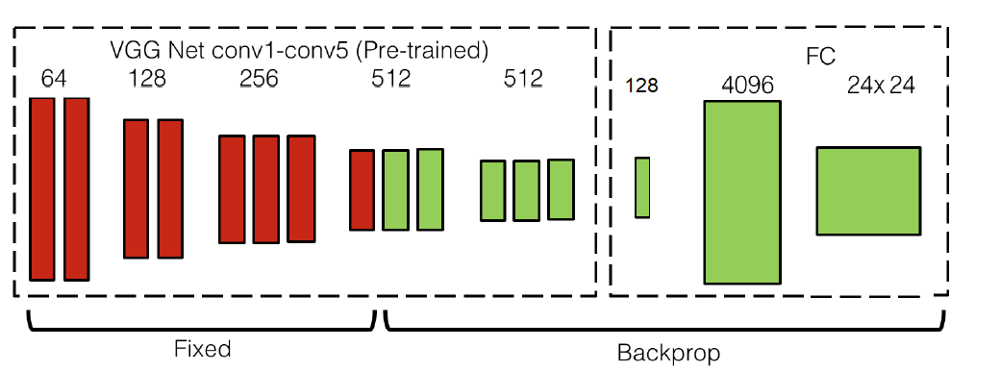
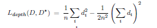
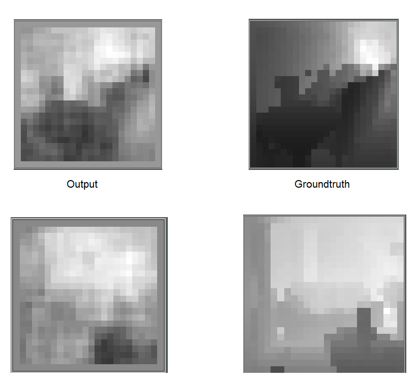

# Fine-Tuning Vgg16 For Depth Estimation

### Introduction
This repository contains a set of python scripts to fine-tune a vgg16 model in order to do real-time depth estimation task

### Network Architecture
I've added a 1*1 conv in order to reduce the number of channels of the last conv layer from 512 to 128.This reduce the model size in order to make it fit in my poor GPU [2GB].

Note: I think implementing a FC-Layers is an improper approach to do this task instead i am currently training a model using a simple Up-Conv technique , I've got that feeling after several failed training sessions and the FC-layers are discriminative by its' nature.

I've added a Scale-Invarient Loss because i think learning relative depth estimation is much easier.

### Dataset
I've used the NYU Depth V2 dataset.

### Training
For the FC Implementation : I am working on it, but currently i am stucked at 0.15 RMSE on training data and 0.45 RMSE on validation data.

For the Up-Conv Implementation : I've reached a 0.109 RMSE on Training data and a 0.165 RMSE on Validation data. 

### Output

Note : the provided output samples are predicted by the Up-Conv implementation

### Conclusion

I've used only 1449 image-depthmap pairs during this fine-tuning process, I think getting more data will help me to significantly improve my results
